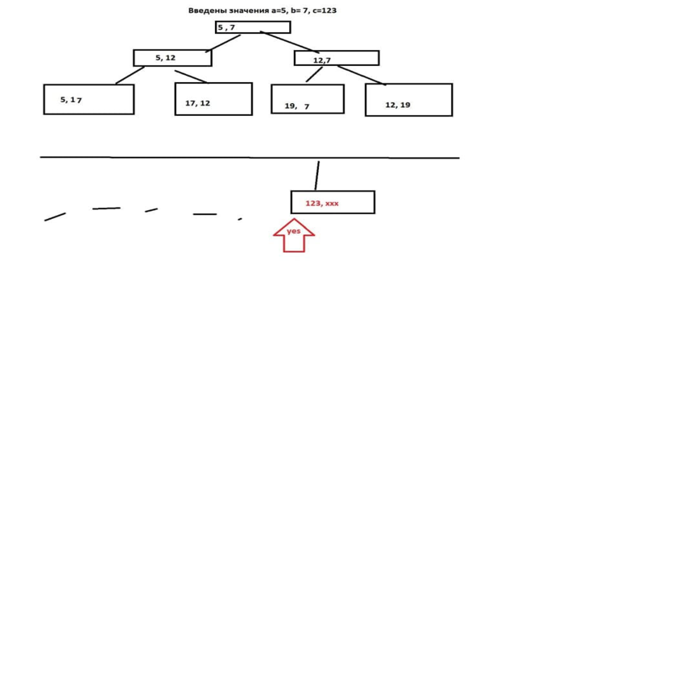
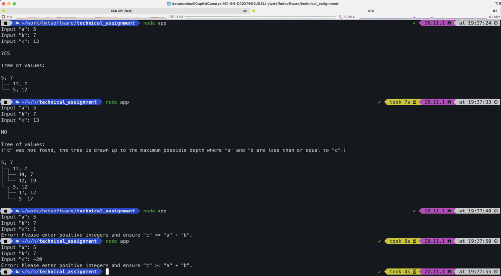
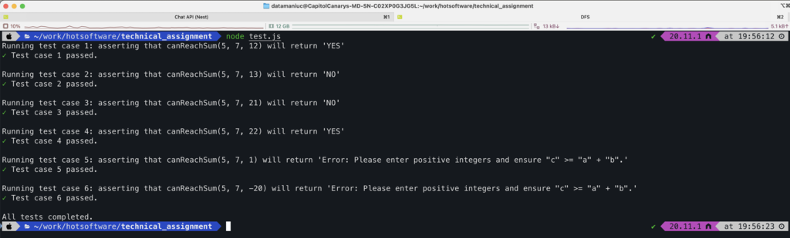

### Тестовое задание: Проверка достижимости значения путем сложения двух чисел
```
Даны три целые числа a, b, c больше 0. Есть два варианта либо добавлять b к a (a+=b), либо добавлять a к b (b+=a).  
В результате получаются новые значение а и b. 
Напишите программу на NODE JS, которая выведет YES или NO в зависимости от того можете ли получить значение c, добавляя a к b или b к a друг к другу.

P.S. где с не ограничено большое значение
```


### Установка и запуск
1. `git clone git@github.com:atamaniuc/hotsoftware_technical_assignment.git` или `gh repo clone atamaniuc/hotsoftware_technical_assignment`
2. `cd technical_assignment`
3. `nvm use v22.4.1`
4. `npm i`
5. `node app.js`



6. `node test.js`



### Описание работы

Этот проект включает реализацию алгоритма для проверки возможности достижения заданного числа `c` путём сложения чисел `a` и `b`. Реализована оптимизация через использование `Breadth-First Search` (BFS) для эффективного обхода возможных комбинаций чисел.

### Основные компоненты

#### 1. Основной файл `app.js`

Основной файл выполняет следующие функции:
- Запрашивает у пользователя ввод чисел `a`, `b` и `c`.
- Проверяет корректность ввода.
- Вызывает функцию для проверки возможности достижения числа `c`.
- Отображает результат и время выполнения.

#### 2. Проверка корректности ввода

Функция `isValidInput` проверяет, что все введенные значения являются положительными целыми числами, и что `c` не меньше суммы `a` и `b`.

#### 3. Расчет наибольшего общего делителя (НОД)

```
// Greatest Common Divisor (GCD)
const gcd = (x, y) => {
    while (y !== 0) {
        [x, y] = [y, x % y];
    }
    return x;
}
```
Назначение: Вычисляет наибольший общий делитель `(НОД)` двух чисел x и y.
Алгоритм: Использует алгоритм Евклида, эффективный метод нахождения `НОД`.
Временная сложность: `O(log(min(x, y)))` - логарифмическое время, очень эффективно.
#### 4. Основной алгоритм `canReachSum`

Функция `canReachSum` использует алгоритм поиска в ширину (Breadth-First Search, BFS) для обхода всех возможных комбинаций чисел `a` и `b`, которые могут быть получены путём их сложения.

### Функция canReachSum(a, b, c)

```javascript
const canReachSum = (a, b, c) => {
    if (c % gcd(a, b) !== 0) {
        return false;
    }

    const visited = new Set();
    const queue = [[a, b]];

    while (queue.length > 0) {
        const [currentA, currentB] = queue.shift();

        if (currentA === c || currentB === c) {
            return true;
        }

        const nextA = currentA + currentB;
        const nextB = currentB + currentA;

        if (nextA <= c && !visited.has(`${nextA},${currentB}`)) {
            visited.add(`${nextA},${currentB}`);
            queue.push([nextA, currentB]);
        }

        if (nextB <= c && !visited.has(`${currentA},${nextB}`)) {
            visited.add(`${currentA},${nextB}`);
            queue.push([currentA, nextB]);
        }
    }

    return false;
}
```

Назначение:

Определяет, можно ли получить целевую сумму c путем последовательного прибавления чисел a или b друг к другу.

Алгоритм:
## Принципы работы кода (canReachSum и Deque)

### canReachSum

Функция `canReachSum` реализует алгоритм поиска в ширину (BFS) с использованием дек (deque) и мемоизации для проверки возможности достижения заданного числа `c` путём сложения двух заданных чисел `a` и `b`.

#### Параметры:

- `a`: Первое целое число.
- `b`: Второе целое число.
- `c`: Целевое число, которое нужно достичь.

#### Алгоритм:

1. **Проверка на возможность достижения c с использованием НОД:**
    - Сначала проверяется, делится ли `c` на НОД чисел `a` и `b`. Если нет, то достижение `c` невозможно, и функция возвращает `false`.

2. **Инициализация:**
    - Создаётся дек (двусторонняя очередь) для хранения пар чисел, которые необходимо проверить.
    - Создаётся объект `visited` для мемоизации, чтобы избежать повторной обработки уже проверенных пар чисел.

3. **Основной цикл BFS:**
    - Пока дек не пуст, извлекается первая пара чисел (`currentA`, `currentB`) из очереди.
    - Проверяется, равняется ли одно из чисел `currentA` или `currentB` целевому числу `c`. Если да, возвращается `true`.
    - Если пара чисел ещё не была обработана, она добавляется в объект `visited`.
    - Добавляются новые пары чисел в дек, если они не превышают `c` и ещё не были обработаны.

4. **Возвращение результата:**
    - Если все возможные комбинации чисел проверены, а целевое число `c` не достигнуто, возвращается `false`.

### Deque

Класс `Deque` реализует двустороннюю очередь с методами для добавления и удаления элементов с обоих концов очереди.

#### Методы:

- **Конструктор (`constructor`)**:
    - Инициализирует пустую очередь с объектом `items` для хранения элементов и счётчиками `front` и `back`.

- **isEmpty()**:
    - Проверяет, пуста ли очередь.

- **addFront(element)**:
    - Добавляет элемент в начало очереди. Если очередь пуста, инкрементирует `back`.

- **addBack(element)**:
    - Добавляет элемент в конец очереди.

- **removeFront()**:
    - Удаляет и возвращает элемент из начала очереди. Если очередь пуста, возвращает `undefined`.

- **removeBack()**:
    - Удаляет и возвращает элемент из конца очереди. Если очередь пуста, возвращает `undefined`.

- **front()**:
    - Возвращает элемент из начала очереди без его удаления. Если очередь пуста, возвращает `undefined`.

- **back()**:
    - Возвращает элемент из конца очереди без его удаления. Если очередь пуста, возвращает `undefined`.

- **size()**:
    - Возвращает количество элементов в очереди.

- **clear()**:
    - Очищает очередь.

### Использование

1. Функция `canReachSum` использует двустороннюю очередь (deque) для реализации поиска в ширину (BFS), начиная с заданных чисел `a` и `b`.
2. В процессе работы функция добавляет в очередь новые пары чисел, полученные путём сложения текущих значений, и проверяет возможность достижения целевого числа `c`.
3. Для предотвращения повторной обработки уже проверенных пар чисел используется объект `visited`.

Этот подход позволяет эффективно проверять достижимость заданного числа, избегая повторных вычислений и оптимизируя процесс с использованием мемоизации и двусторонней очереди.

### Сложность
**Пространственная сложность: O(c / gcd(a, b))**

Пространственная сложность определяется количеством уникальных пар чисел, которые могут быть сгенерированы, и объёмом памяти, необходимым для хранения этих пар в объекте visited и очереди deque.

**Временная сложность: O(c / gcd(a, b))**

Временная сложность определяется количеством состояний, которые нужно проверить, и временем, затрачиваемым на обработку каждого состояния.

#### 5. Построение дерева (опционально)

Функция `buildTree` может быть использована для построения дерева всех возможных комбинаций чисел `a` и `b`.

- **Очередь**: Используется для хранения текущих узлов дерева.
- **Множество посещённых**: Используется для отслеживания уже проверенных узлов дерева.
- **Добавление узлов**: Новые узлы добавляются в дерево, если они не превышают `c` и ещё не были проверены.


### Скорость выполнения: обрабатывает c=100000 за ~ 12 sec
```
time node app.js 
Input "a": 5
Input "b": 7
Input "c": 100000

YES
Execution Time: 7.995s
node app.js  9.37s user 1.15s system 59% cpu 17.557 total
```
ранилось на `2,2 GHz 6-Core Intel Core i7`
